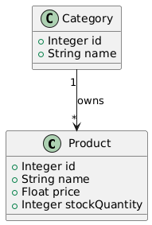
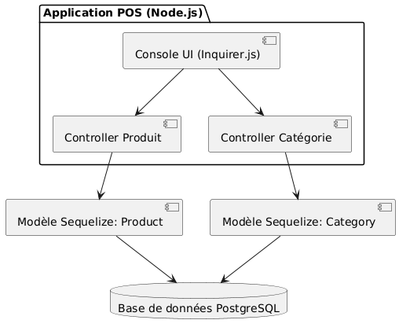
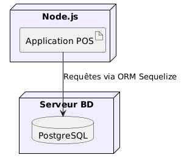
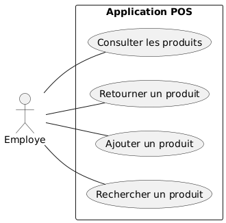
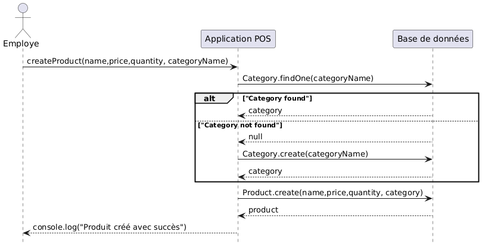
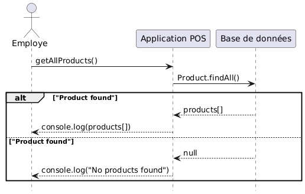
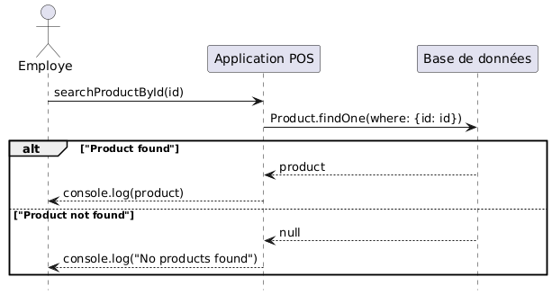
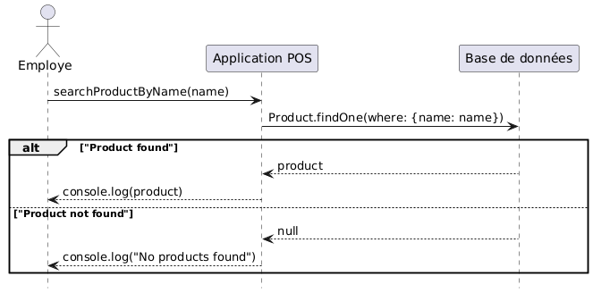
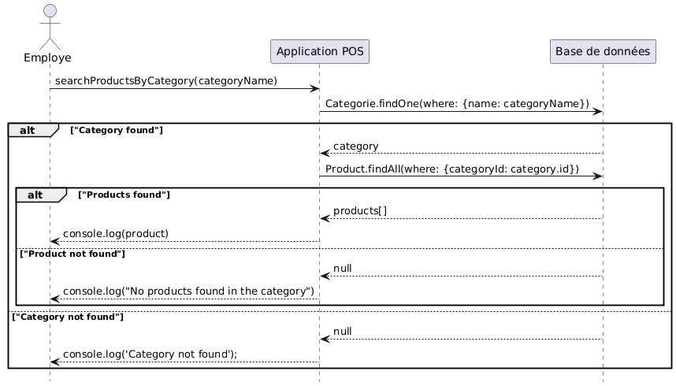
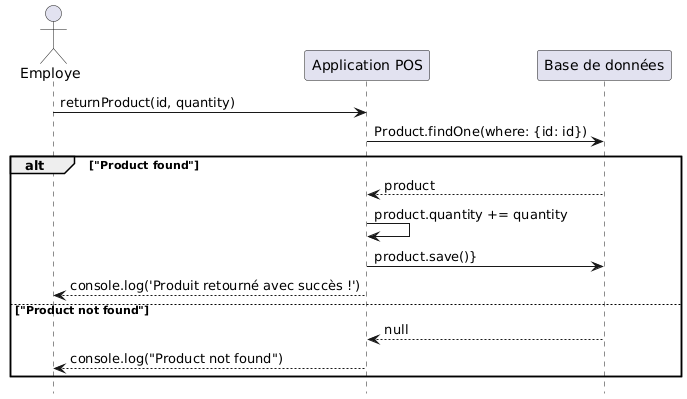

# LOG430-Lab

# Description Arc42

## Contexte

Cette application est un système point de vente permettant de :

## Besoins fonctionnels

- Rechercher un produit
    - par nom, identifiant et catégorie
- Ajouter un produit
- Retourner un produit
    - mettre à jour son stock
- Consulter les produits

## Besoins non fonctionnels

Architecture Client / Serveur

Robuste (gère les erreurs, ne plante pas en cas d’erreur)

Persistance des données

Simple (facile à prendre en main pour l’usager)

## Contrainte 

Cette application doit :

Doit fonctionner sans interface graphique (terminal uniquement).

Doit persister les données de manière fiable.

Doit être conteneurisable avec Docker pour faciliter le déploiement.

## Vue logique



## Vue implémentation



## Vue déploiement



## Vue cas d'utilisation



## Vue processus













## ADR

### ADR 1

### Titre 

Choix de la plateforme

### Status

Accepted

### Contexte

Dans le cadre de ce laboratoire, j’ai du choisir une technologique adapter au but de celui-ci soit de concevoir une application point de vente (POS) avec une architecture serveur à deux couches. Les utilisateurs intéragisses avec cette application au travers de la console.

### Décision

J’ai choisi d’opter pour Node.js ainsi que le language de programmation Javascript pour le dévelopement de mon application.

### Conséquences

Propose une large variété de module très utile au développement de projet (Sequelize, Inquirer.js, Jest)

Facile à utiliser avec Docker et à mettre en place la pipieline CI/CD via Github Action

Sa popularité fait en sorte qu’il est facile de trouver des informations en cas de problème

Bonne documentation offerte

### ADR 2

### Titre 

Stratégie de persistence

### Status

Accepted

### Contexte

Dans le cadre de ce laboratoire, l’application point de vente (POS) doit pouvoir manipuler les données des différents produits et catégories, ainsi que sauvegardés celle-ci de manière fiable et durable.

### Décision

J’ai choisi d’opter pour l’ORM Sequelize afin de gérer les interactions entre mon application et la base de données postgreSQL. 

### Consequences

Sequelize prend en charge la création de schéma ainsi que des relations rendant le développement plus facile

Sequelize prend en charge la synchronization des tables soit va effectuer les modifications nécessaire dans la base données si des modifications ont eu lieu dans le code.

Sequelize s’occupe de l’abstraction des requêtes SQL évitant de devoir écrire et exécuter chaque requête soi-même.

### Choix technologiques

### 1. **Node.js**

- **Justification** : Plateforme légère et rapide
- **Simplicité** : Écosystème riche en modules npm
- **Portabilité** : Fonctionne sur tous les système d’exploitation
- **Coût** : Gratuit et open source
- **Fiabilité** : Très populaire dans l’industrie avec une communauté active.

### 2. **PostgreSQL**

- **Justification** : Système de gestion de base de données relationnelle robuste et fiable
- **Simplicité** : Offre une documentation complète
- **Portabilité** : Fonctionne sur tous les système d’exploitation et facile à containeriser via Docker.
- **Coût** : Gratuit et open source
- **Fiabilité** : Conforme au propriété ACID (Atomicity, Consistency, Isolation, Durability)

### 3. **Sequelize (ORM)**

- **Justification** : Permet d’abstraire les opérations SQL via un modèle orienté objet
- **Simplicité** : Permet la manipulation des données sans écrire de requêtes SQL
- **Portabilité** : Facile à implémenter dans n’importe quel projet
- **Coût** : Gratuit et open source
- **Fiabilité** : Fiable pour les petits projets tel que POS

### 4. **Inquirer.js**

- **Justification** : Bibliothèque permettant à l’utilisateur d’interagir via la console
- **Simplicité** : API claire et intuitive pour concevoir des interfaces textuelles interactives
- **Portabilité** : Fonctionne dans n’importe quel terminal
- **Coût** : Gratuit, open source
- **Fiabilité** : Fiable pour les petits projets tel que POS

### 6. **Jest**

- **Justification** : Framework de test pour Node.js
- **Simplicité** : Intégration facile, compatible avec la majorité des bibliothèques JS
- **Portabilité** : Fonctionne sur toutes plateforme Node.js
- **Coût** : Gratuit
- **Fiabilité** : Permet d’assurer la qualité du code via des tests automatisés.

## Instructions d'exécution
Prérequis:
    Git
    Docker
    Docker Compose


1. Clone le projet :
   - Se placer dans le dossier destination, y ouvrir une fenêtre de terminal/invite commande puis entrer la commande suivante:
   ```
   git clone https://github.com/Jonathan-Lorfils/LOG430-Lab.git
   ```

   - Ouvrir le dossier contenant le projet avec la commande :
   
   ```
   cd LOG430-Lab
   ```

   ```
   git checkout labo01
   ```

2. Lancer le container
   - Ouvrir le répertoire avec la commande suivante :

    ```
    cd app
    ```

    - Construire le conteneur
    
    ```
    docker-compose build
    ```

    - Lancer le conteneur

    ```
    docker-compose up
    ```

    -- Ouvrir un nouveau terminal et exécuter la commande

    ```
    docker compose run --rm app
    ```

## Structure

```
.
├── app
│   ├── docker-compose.yml
│   ├── Dockerfile
│   ├── eslint.config.js
│   ├── jest.config.js
│   ├── package-lock.json
│   ├── package.json
│   ├── src
│   │   ├── controllers
│   │   │   ├── CategoryController.js
│   │   │   └── ProductController.js
│   │   ├── database.js
│   │   ├── index.js
│   │   └── models
│   │       ├── Category.js
│   │       └── Product.js
│   └── test
│       ├── CategoryController.test.js
│       ├── ProductController.test.js
│       └── script.test.js
├── docs
│   ├── ADR
│   │   ├── ADR1.md
│   │   └── ADR2.md
│   └── UML
│       ├── VueCasUtilisation.puml
│       ├── VueDeploiement.puml
│       ├── VueImplementation.puml
│       ├── VueLogique.puml
│       ├── VueProcessusAjouterProduit.puml
│       ├── VueProcessusConsulterProduits.puml
│       ├── VueProcessusRechercherProduitId.puml
│       ├── VueProcessusRechercherProduitNom.puml
│       ├── VueProcessusRechercherProduitsCategorie.puml
│       └── VueProcessusRetournerProduit.puml
├── out
│   └── docs
│       └── UML
│           ├── VueCasUtilisation
│           │   └── VueCasUtilisation.png
│           ├── VueDeploiement
│           │   └── VueDeploiement.png
│           ├── VueImplementation
│           │   └── ComposantsPOS.png
│           ├── VueLogique
│           │   └── POS_Product_Category.png
│           ├── VueProcessusAjouterProduit
│           │   └── VueProcessusAjouterProduit.png
│           ├── VueProcessusConsulterProduits
│           │   └── VueProcessusConsulterProduits.png
│           ├── VueProcessusRechercherProduitId
│           │   └── VueProcessusRechercherProduitId.png
│           ├── VueProcessusRechercherProduitNom
│           │   └── VueProcessusRechercherProduitNom.png
│           ├── VueProcessusRechercherProduitsCategorie
│           │   └── VueProcessusRechercherProduitCategorie.png
│           └── VueProcessusRetournerProduit
│               └── VueProcessusRetournerProduit.png
└── README.md
```
