# LOG430-Lab

Lien vers le repo github (chaque laboratoire à sa propre branche) : https://github.com/Jonathan-Lorfils/LOG430-Lab

Lien vers la documentation Swagger UI : http://localhost:3000/api-docs

## Instructions d'exécution
Prérequis:
    Git
    Docker
    Docker Compose


1. Clone le projet :
   - Se placer dans le dossier destination, y ouvrir une fenêtre de terminal/invite commande puis entrer la commande suivante:
   ```
   git clone https://github.com/Jonathan-Lorfils/LOG430-Lab.git
   ```

   - Ouvrir le dossier contenant le projet avec la commande :
   
   ```
   cd LOG430-Lab
   ```

   ```
   git checkout labo03
   ```

2. Lancer le container
   - Ouvrir le répertoire avec la commande suivante :

    ```
    cd app
    ```

    - Construire le container
    
    ```
    docker-compose build
    ```

    - Lancer le container

    ```
    docker-compose up
    ```

    -- Ouvrir le navigateur web de votre choix et accéder à l'url suivant :

    ```
    http://localhost:3000/api-docs
    ```

    -- Avant de tester les appels entrer le token statique en suivant les étapes:

    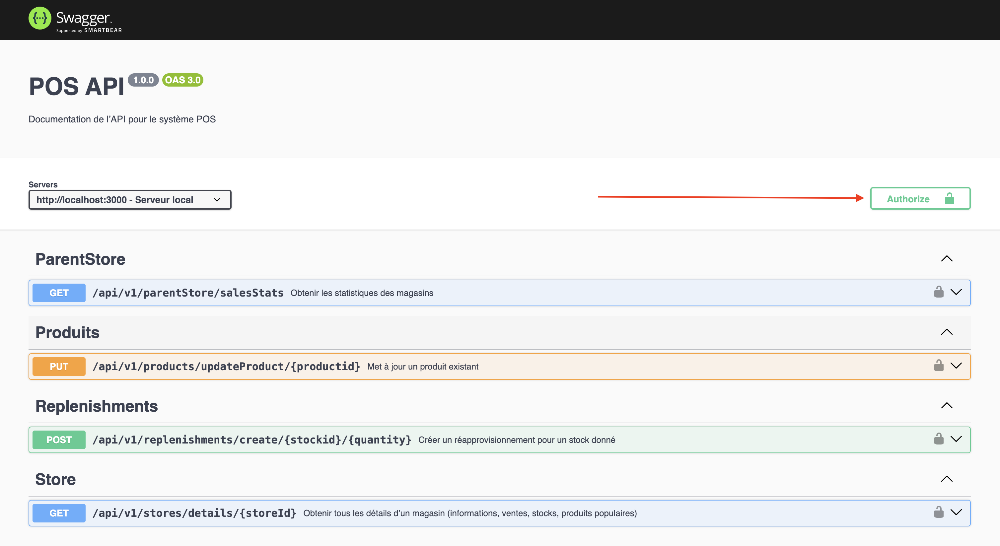

    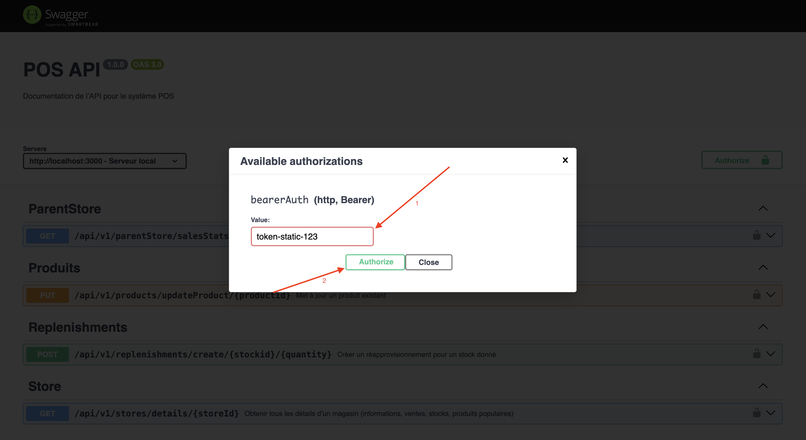

    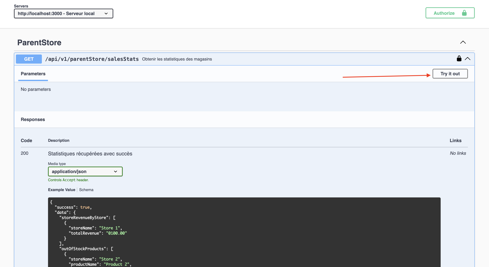


## Instruction de test

### ParentStore 

  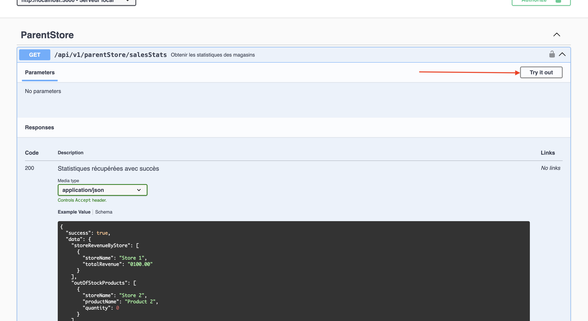

  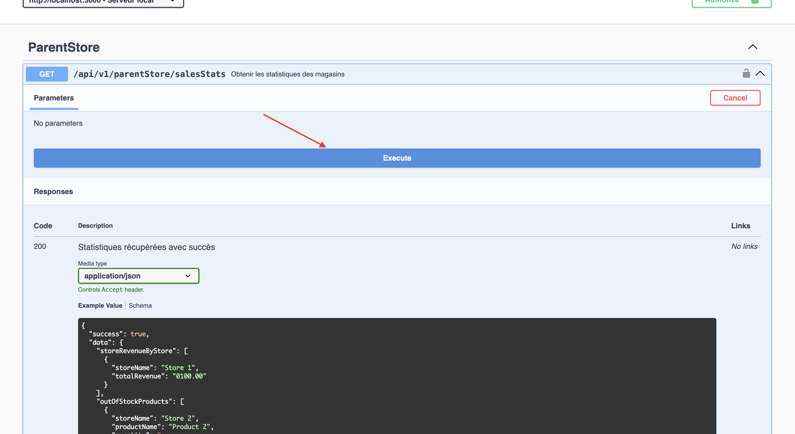

### Product 

  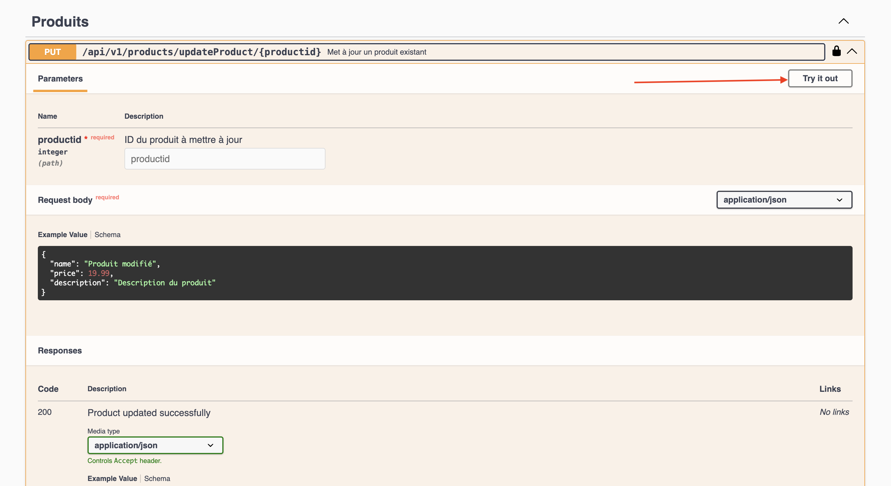

  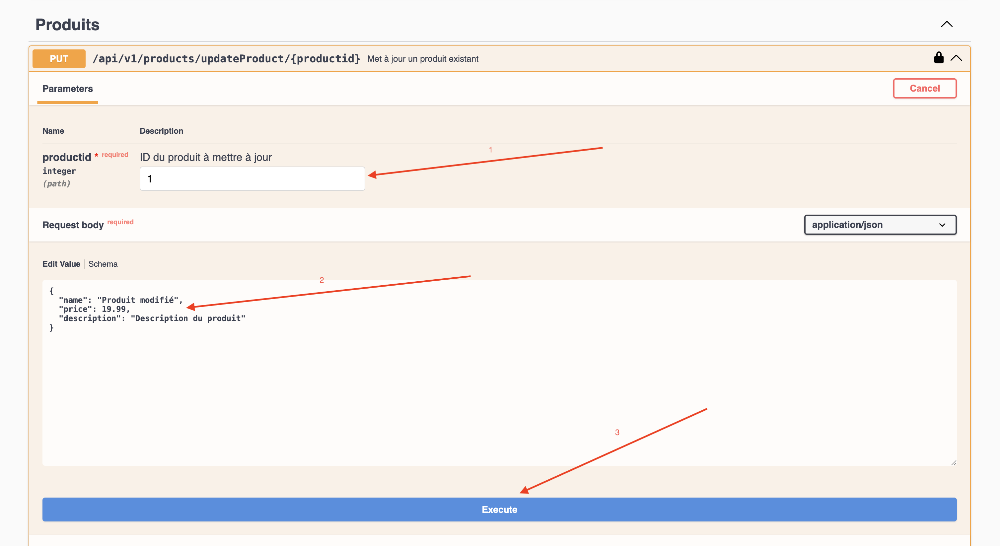

### Replenishment

  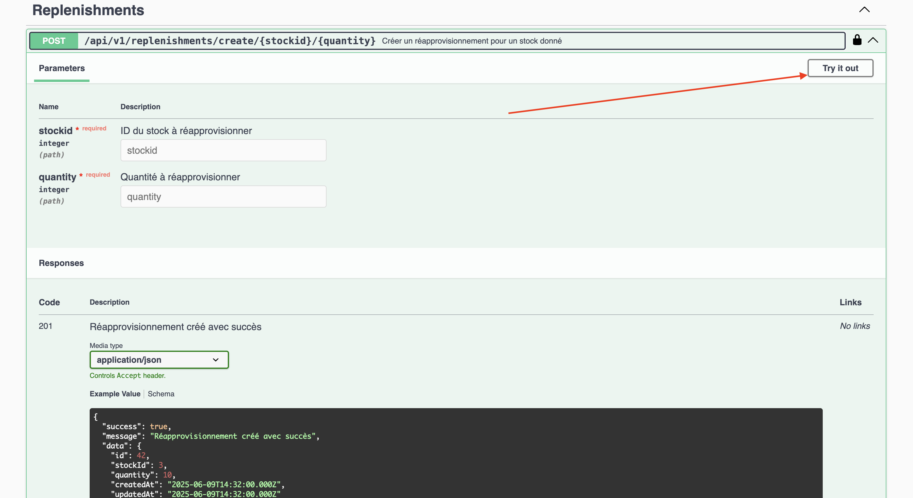

  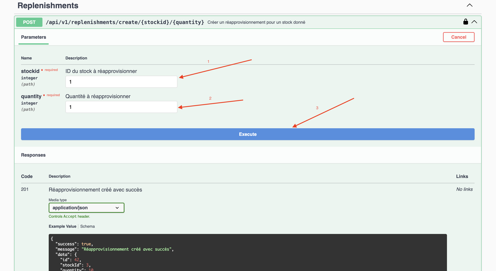

### Store

  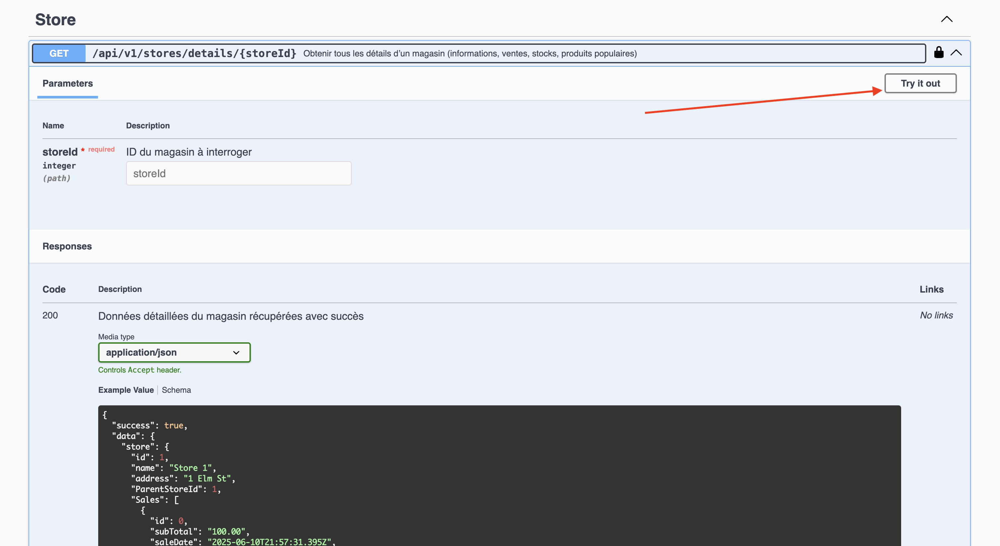

  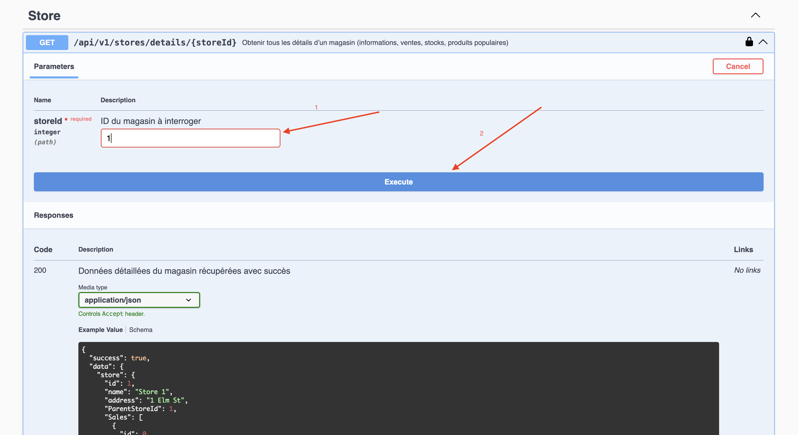

## Introduction

Dans le cadre de ce laboratoire 02, j’ai eu à faire évoluer l’architecture de mon application point de vente afin de convenir aux nouveaux besoins du client. 

## Contexte

Présentement mon application POS me permet d’effectuer une recherche sur un produit basé sur le nom, identifiant ou la catégorie, ajouter un produit, effectuer un retour et consulter les produits disponibles. Cette application convenait aux objectifs fournis par le client dans le cadre du laboratoire 01, mais est obsolète face au requis du laboratoire 02.

## Requis 

Le client souhaite désormais que l’application lui permette de gérer 5 magasins situés dans des quartiers différents, un centre logistique, ainsi que d’offrir des fonctionnalités administratives pour les gestionnaires de la maison mère.

---

Exigences fonctionnelles

En tant que gestionnaire de la maison mère, je veux pouvoir :
- Consulter un tableau de bord regroupant les informations suivantes par magasin :
  - Chiffre d’affaires  
  - Alerte de rupture de stock  
  - Tendance hebdomadaire  
  - Produit en surstock
- Consulter un rapport regroupant les informations suivantes par magasin :
  - Ventes  
  - Produits les plus vendus  
  - Stock restant

En tant qu’employé d’un magasin, je veux pouvoir :
- Consulter les stocks du centre logistique
- Initier une demande de réapprovisionnement en cas de stock insuffisant


## Objectif qualité

Qualités rechercher par le client 
1	Permettre une évolutivité vers une potentielle interface web ou mobile.
2	Synchronisation fiable et cohérente des données entre les différents magasins et la maison mère.
3	Offrir une consultation centralisée des stocks disponibles et des transactions réalisées des les magasins

| Objectif de qualité | Description                                                                                                                             |
| ------------------- | --------------------------------------------------------------------------------------------------------------------------------------- |
| **Convivialité**    | Je veux que mon application soit facile à prendre en main pour les employés des magasins ainsi que les gestionnaires de la maison mère. |
| **Transférabilité** | Je veux que mon environnement puisse facilement évoluer vers un autre environnement.                                                    |
| **Intégrité**       | Je veux m’assurer que les données soient cohérentes et restent fidèles aux opérations réelles.                                          |


## Stakeholder

| Rôle / Nom                         | Fonctionnalités                                                                                                                                                                                                                                                                                                                                                                                                                                    |
| ---------------------------------- | -------------------------------------------------------------------------------------------------------------------------------------------------------------------------------------------------------------------------------------------------------------------------------------------------------------------------------------------------------------------------------------------------------------------------------------------------- |
| **Gestionnaire de la maison mère** | - Consulter un tableau de bord regroupant les informations suivantes par magasin : <br> &nbsp;&nbsp;• Chiffre d’affaires <br> &nbsp;&nbsp;• Alerte de rupture de stock <br> &nbsp;&nbsp;• Tendance hebdomadaire <br> &nbsp;&nbsp;• Produit en surstock <br> <br> - Consulter un rapport regroupant les informations suivantes par magasin : <br> &nbsp;&nbsp;• Ventes <br> &nbsp;&nbsp;• Produits les plus vendus <br> &nbsp;&nbsp;• Stock restant |
| **Employé d’un magasin**           | En tant qu’employé d’un magasin, je veux pouvoir : <br> - Consulter les stocks du centre logistique <br> - Initier une demande de réapprovisionnement en cas de stock insuffisant                                                                                                                                                                                                                                                                  |


## Contraintes architecturales

Contraintes
L’architurecture de l’application doit être hébergé en utilisant la VM fournise.
L’architurecture de l’application doit être dockeriser
L’architurecture de l’application doit permettre une migration vers une interface web ou mobile.

## Contexte technique

Le client souhaite pouvoir interagir avec l’application depuis chaque magasin, tandis que l’application roule sur la VM mise à disposition.

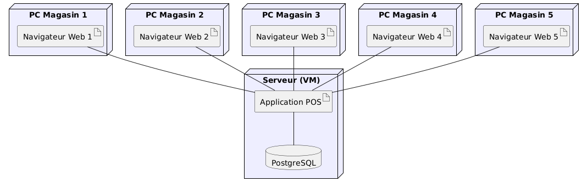

## Stratégie de solution

| Problème identifié                                | Défauts                                                                                                                         | Solution proposée                                                                                              |
| ------------------------------------------------- | ------------------------------------------------------------------------------------------------------------------------------- | -------------------------------------------------------------------------------------------------------------- |
| **Architecture serveur / client à 2 tiers**       | - Fort couplage entre l’interface utilisateur et la logique métier  <br> - Évolution difficile vers une interface web ou mobile | - Migration vers une architecture 3 tiers (MVC) séparant l’interface, la logique métier et l’accès aux données |
| **Interaction avec l’utilisateur via la console** | - Interface limitée  <br> - Peu de possibilités d’évolution de l’interface utilisateur (UI)                                     | - Création d’une interface web avec EJS                                                                        |
| **Vue logique**                                   | - Obsolète face aux nouveaux requis                                                                                             | - Mise à jour de la vue logique pour représenter la nouvelle logique d’affaires                                |

## Vue logique

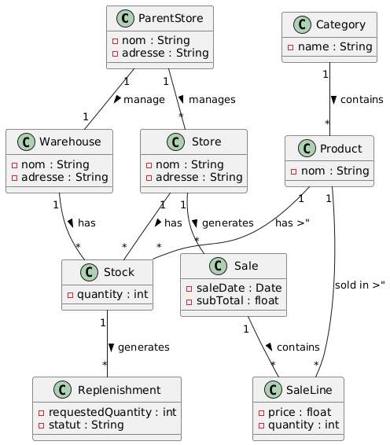

À noter que je n'ai pas fait d'héritage pour les entités Store et Warehouse étant donné que l'ORM que j'utilise présentement, Sequelize, ne le supporte pas pour le moment.

## Vue implémentation

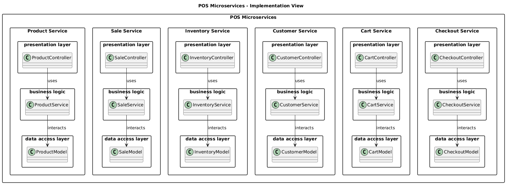

Le diagramme suit la méthodologie MVC soit :

Controller : Responsable de l’interaction entre l’application et l’utilisateur. Se charge d’appeler les services appropriés afin de récupérer les informations nécessaires puis retourne une vue à l’utilisateur. 

Vue : Présente les données à l’utilisateur, fonctionne en collaboration avec le controlleur.

Model : Contient la logique relié au données et leur logique d’accès. 


## Vue déploiement


## Vue cas d'utilisation

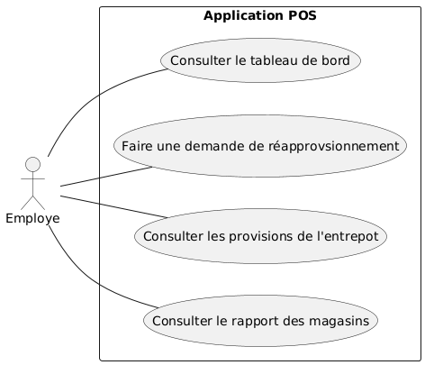

## Vue processus

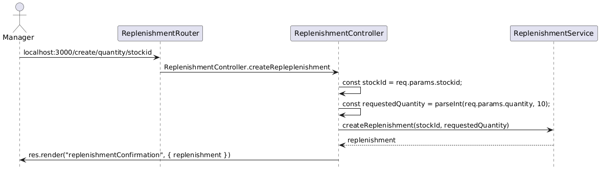

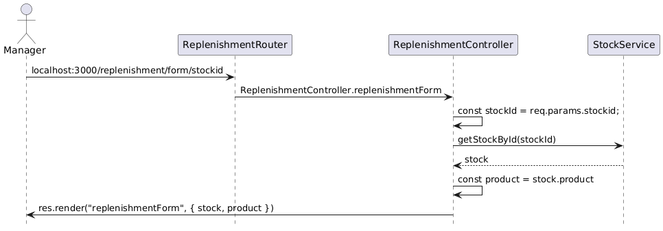

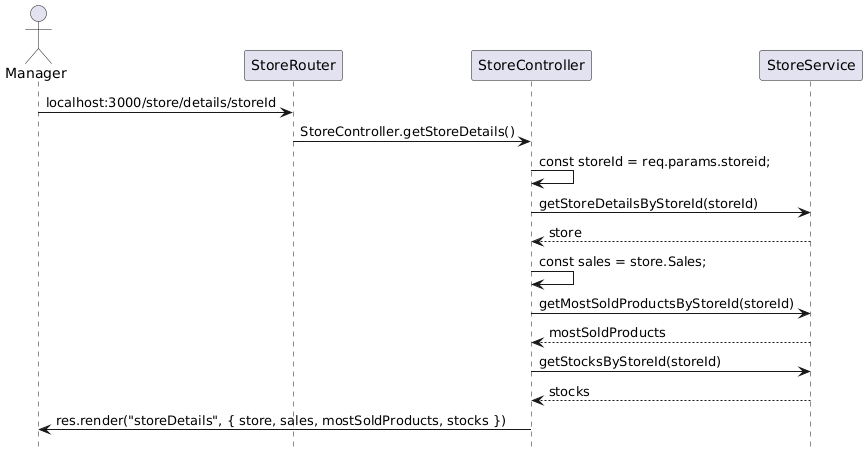

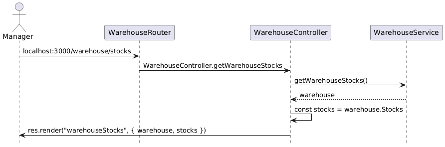

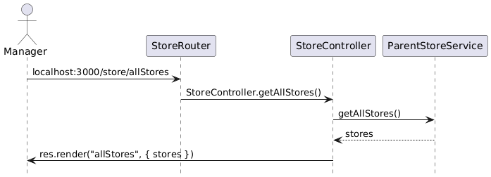

## ADR

### ADR 1

### Titre

Choix de l’architecture

### Status

Accepté

### Contexte

Dans le cadre de ce laboratoire, l’application point de vente doit pouvoir répondre aux besoins d’une entreprise possédant cinq magasins, un centre logistique et une maison mère. La structure précédente soit une architecture client / serveur 2 tier n’est plus suffisante afin de répondre aux besoins du client.

### Décision

Faire évoluer l’architecture actuel vers une architecture client / serveur 3 tier.

#### Conséquence

Nécessite de modifier le code existant afin de convenir à cette nouvelle architecture.

Permet une meilleure séparation des responsabilités réduisant ainsi le couplage entre la logique métier et l’interface usager.

Permet une meilleure évolutivité de l’application dans notre cas, vers une possible interface web ou mobile.

Nécessite un structure du code plus stricte. 

### ADR 2

### Titre

Implementation du patron de conception MVC

### Status

Accepté

### Contexte

Afin de répondre aux nouveaux besoins du client, il a été établi dans l’ADR précédent qu’il est nécessaire de faire évoluer l’architecture du logiciel. De plus, le fait de passer à une architecture 3 tier oblige de devoir choisir un patron de conception à suivre afin de séparer les différentes logiques de l’application.

### Décision

Adoption du patron de conception MVC :

Modèle : les entités métier contenant la logique d’accès aux données au travers de l’ORM Sequelize.

Contrôleur : Interagit avec les services métiers et renvoie la vue à l’utilisateur.

Vue : Sert d’interface utilisateur, est affiché dans le navigateur de l’utilisateur.

### Conséquence

Permet une meilleure structure du code et séparation des responsabilités

Permet une évolutivité vers une interface web ou mobile


### Choix technologiques

### 1. **Node.js**

- **Justification** : Plateforme légère et rapide
- **Simplicité** : Écosystème riche en modules npm
- **Portabilité** : Fonctionne sur tous les système d’exploitation
- **Coût** : Gratuit et open source
- **Fiabilité** : Très populaire dans l’industrie avec une communauté active.

### 2. **PostgreSQL**

- **Justification** : Système de gestion de base de données relationnelle robuste et fiable
- **Simplicité** : Offre une documentation complète
- **Portabilité** : Fonctionne sur tous les système d’exploitation et facile à containeriser via Docker.
- **Coût** : Gratuit et open source
- **Fiabilité** : Conforme au propriété ACID (Atomicity, Consistency, Isolation, Durability)

### 3. **Sequelize (ORM)**

- **Justification** : Permet d’abstraire les opérations SQL via un modèle orienté objet
- **Simplicité** : Permet la manipulation des données sans écrire de requêtes SQL
- **Portabilité** : Facile à implémenter dans n’importe quel projet
- **Coût** : Gratuit et open source
- **Fiabilité** : Fiable pour les petits projets tel que POS

### 4. **Jest**

- **Justification** : Framework de test pour Node.js
- **Simplicité** : Intégration facile, compatible avec la majorité des bibliothèques JS
- **Portabilité** : Fonctionne sur toutes plateforme Node.js
- **Coût** : Gratuit
- **Fiabilité** : Permet d’assurer la qualité du code via des tests automatisés.

### 5. EJS

- **Justification** : Moteur de template qui permet de générer des pages HTML dynamiques à partir de données serveur
- **Simplicité** : Syntaxe proche de HTML avec intégration facile de logique JS
- **Portabilité** : Compatible avec Express
- **Coût** : Gratuit et open source
- **Fiabilité** : Suffisant pour des vues dynamiques simples

### 6. Express

- **Justification** : Framework permettant de créer des serveurs web en Node.js
- **Simplicité** : Syntaxe simple, facilite la gestion des routes, middlewares et requêtes HTTP
- **Portabilité**  : Fonctionne avec tout projet Node.js, s’intègre facilement à d’autres bibliothèques comme Sequelize ou EJS
- **Coût**  : Gratuit et open source
- **Fiabilité**  : Maintenu activement par la communauté et utilisé dans des milliers de projets professionnels

### Domain-Driven Design 

Dans le cadre du développement de l’application POS j’ai identifié les sous-domaines suivants :  

| Domaine                           | Type de domaine | Responsabilités principales                                                                                                    |
| --------------------------------- | --------------- | ------------------------------------------------------------------------------------------------------------------------------ |
| **Gestion des ventes**            | Domaine central | - Gérer les ventes  <br> - Mettre à jour les stocks                                                                            |
| **Gestion de la logistique**      | Domaine support | - Gérer les demandes de réapprovisionnement  <br> - Faire le suivi des stocks                                                  |
| **Supervision de la maison mère** | Domaine support | - Suivre la performance des magasins  <br> - Suivre les tendances et demandes des magasins <br> - Générer un rapport consolidé |


## Structure

```
.
├── app
│   ├── docker-compose.yml
│   ├── Dockerfile
│   ├── eslint.config.js
│   ├── jest.config.js
│   ├── package-lock.json
│   ├── package.json
│   ├── src
│   │   ├── controllers
│   │   │   ├── ParentStoreController.js
│   │   │   ├── ReplenishmentController.js
│   │   │   ├── StoreController.js
│   │   │   └── WarehouseController.js
│   │   ├── CreateFakeData.js
│   │   ├── database.js
│   │   ├── models
│   │   │   ├── Category.js
│   │   │   ├── index.js
│   │   │   ├── ParentStore.js
│   │   │   ├── Product.js
│   │   │   ├── Replenishment.js
│   │   │   ├── Sale.js
│   │   │   ├── SaleLine.js
│   │   │   ├── Stock.js
│   │   │   ├── Store.js
│   │   │   └── Warehouse.js
│   │   ├── routes
│   │   │   ├── ParentStoreRoutes.js
│   │   │   ├── ReplenishmentRoutes.js
│   │   │   ├── StoreRoutes.js
│   │   │   └── WarehouseRoutes.js
│   │   ├── server.js
│   │   ├── services
│   │   │   ├── ParentStoreService.js
│   │   │   ├── ReplenishmentService.js
│   │   │   ├── StockService.js
│   │   │   ├── StoreService.js
│   │   │   └── WarehouseService.js
│   │   └── views
│   │       ├── allStores.ejs
│   │       ├── index.ejs
│   │       ├── parentStoreDashboard.ejs
│   │       ├── replenishmentConfirmation.ejs
│   │       ├── replenishmentForm.ejs
│   │       ├── storeDetails.ejs
│   │       └── warehouseStocks.ejs
│   └── test
│       ├── ParentStoreService.test.js
│       ├── ReplenishmentService.test.js
│       ├── StockService.test.js
│       ├── StoreService.test.js
│       └── WarehouseService.test.js
├── docs
│   ├── ADR
│   │   ├── ADR1.md
│   │   └── ADR2.md
│   └── UML
│       ├── VueCasUtilisation.puml
│       ├── VueDeploiement.puml
│       ├── VueImplementation.puml
│       ├── VueLogique.puml
│       ├── VueProcessusAfficherConfirmationReplenishment.puml
│       ├── VueProcessusAfficherDashboardParentStore.puml
│       ├── VueProcessusAfficherFormulaireReplenishment.puml
│       ├── VueProcessusAfficherLesDetailsDuMagasin.puml
│       ├── VueProcessusAfficherStocksEntrepot.puml
│       └── VueProcessusAfficherTousLesMagasins.puml
├── out
│   └── docs
│       └── UML
│           ├── VueCasUtilisation
│           │   └── VueCasUtilisation.png
│           ├── VueDeploiement
│           │   └── VueDeploiement.png
│           ├── VueImplementation
│           │   └── VuePackagePOS.png
│           ├── VueLogique
│           │   └── VueLogique.png
│           ├── VueProcessusAfficherConfirmationReplenishment
│           │   └── VueProcessusAfficherConfirmationReplenishment.png
│           ├── VueProcessusAfficherFormulaireReplenishment
│           │   └── VueProcessusAfficherFormulaireReplenishment.png
│           ├── VueProcessusAfficherLesDetailsDuMagasin
│           │   └── VueProcessusAfficherLesDetailsDuMagasin.png
│           ├── VueProcessusAfficherStocksEntrepot
│           │   └── VueProcessusAfficherStocksEntrepot.png
│           └── VueProcessusAfficherTousLesMagasins
│               └── VueProcessusAfficherTousLesMagasins.png
└── README.md
```
