# LOG430-Lab

Lien vers le repo github (chaque laboratoire à sa propre branche) : https://github.com/Jonathan-Lorfils/LOG430-Lab

## Instructions d'exécution
Prérequis:
    Git
    Docker
    Docker Compose

1. Clone le projet :
   - Se placer dans le dossier destination, y ouvrir une fenêtre de terminal/invite commande puis entrer la commande suivante:
   ```
   git clone https://github.com/Jonathan-Lorfils/LOG430-Lab.git
   ```

   - Ouvrir le dossier contenant le projet avec la commande :
   
   ```
   cd LOG430-Lab
   ```

   ```
   git checkout labo06
   ```

2. Lancer le container
   - Ouvrir le répertoire avec la commande suivante :

    ```
    cd app
    ```

    - Construire le container
    
    ```
    docker-compose build
    ```

    - Lancer le container

    ```
    docker-compose up
    ```

    -- Ouvrir le navigateur web de votre choix et accéder à l'url suivant :

    ```
    Service produit : http://localhost:3001/api-docs/
    Service vente : http://localhost:3002/api-docs/
    Service inventaire : http://localhost:3003/api-docs/
    Service client : http://localhost:3004/api-docs/
    Service panier : http://localhost:3005/api-docs/
    Service commande (checkout) : http://localhost:3006/api-docs/
    Service magasin : http://localhost:3008/api-docs/
    Service paiement : http://localhost:3009/api-docs/
    Service orchestrateur : http://localhost:3010/api-docs/
    ```

## Instruction de test

### Commande fonctionnel 

  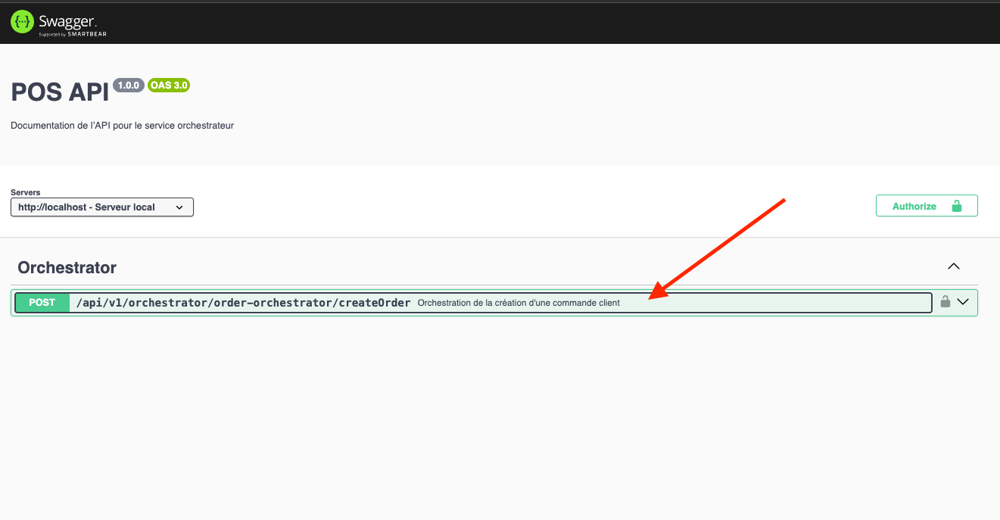

  

  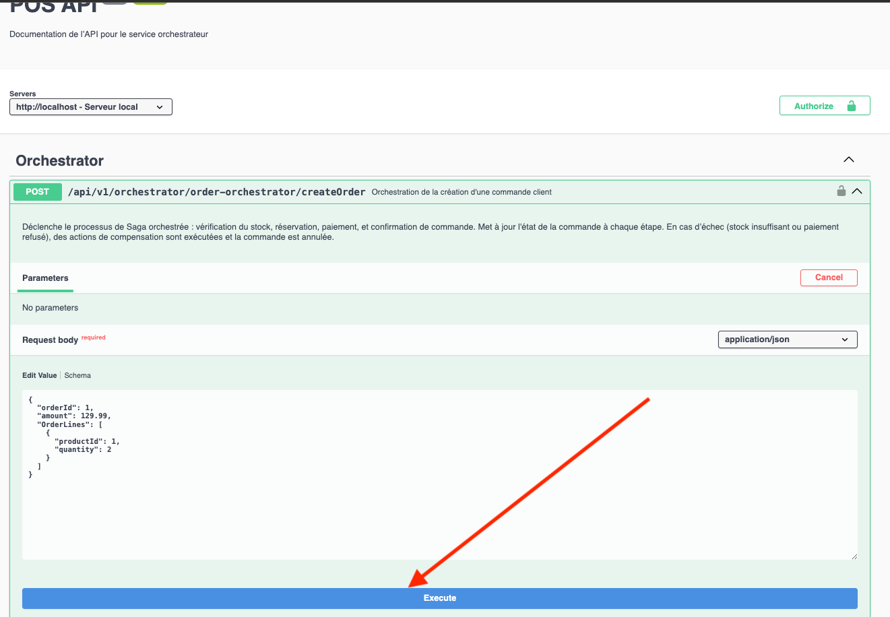

  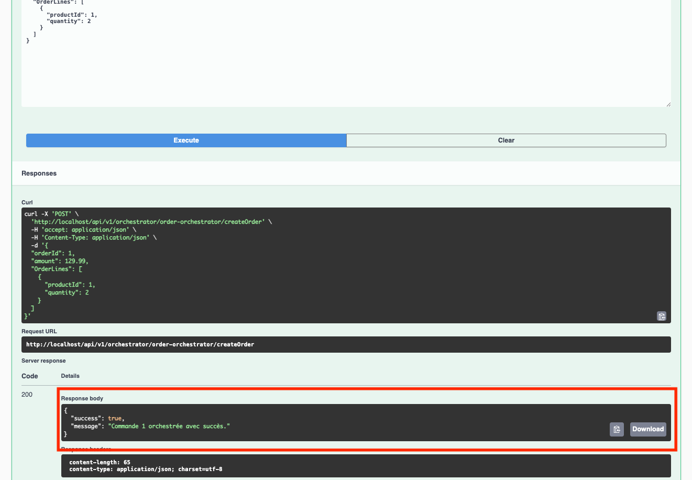

### Commande échouant

  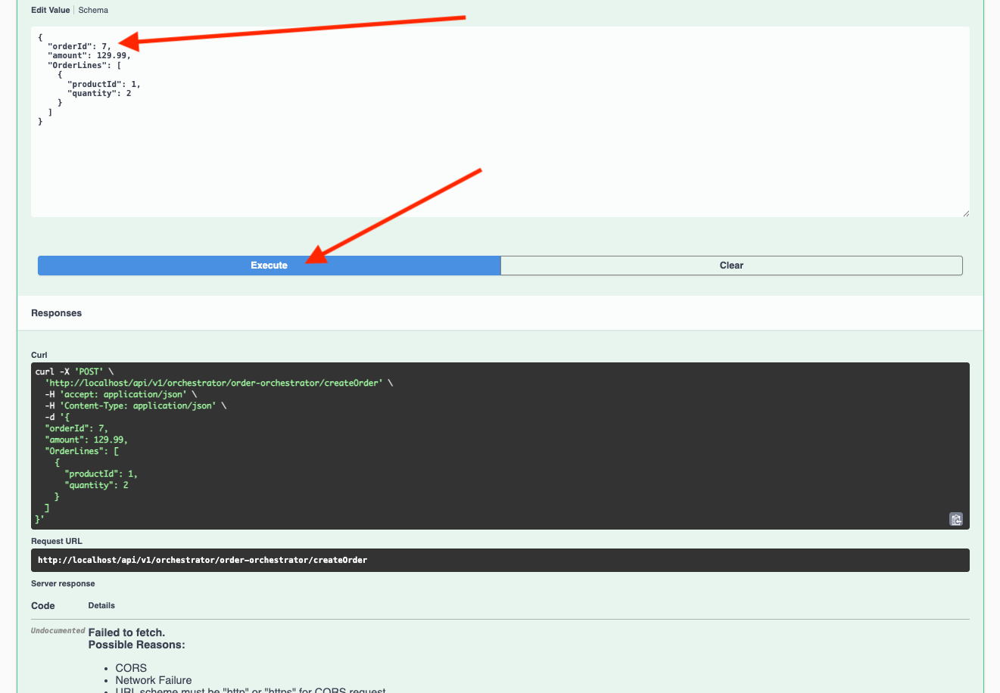

## Rapport Laboratoire 06

### Scénario métier et saga implémentée

#### Scénario : Création de commande

Étapes :

- Vérification du stock :
    - Appel vers InventoryService méthode checkStockAvailability
        - La méthode checkStockAvailability prend un productId et une quantité requise afin de valider si il existe un stock dans le centre logistique correspondant au requis.
- Réservation de stock
    - Appel vers InventoryService méthode reserveStock Fonctionne
        - La méthode reserveStock prend un productId, une quantitée et orderId afin de créer une réservation de stock pour la commande en cours de traitement.
- Paiement
    - Appel vers PaymentService méthode processPayment Fonctionne
        - La méthode processPayment prend un montant, une méthode de paiement et un orderId afin de créer une méthode de paiement ainsi que de procéder au traitement de celui-ci.
- Confirmation ou annulation de commande
    - Appel vers OrderService méthode confirmOrder Fonctionne
        - La méthode confirmOrder s’assure que la commande est bien dans le système et change son status à complèter.

## Diagramme de machine d'état

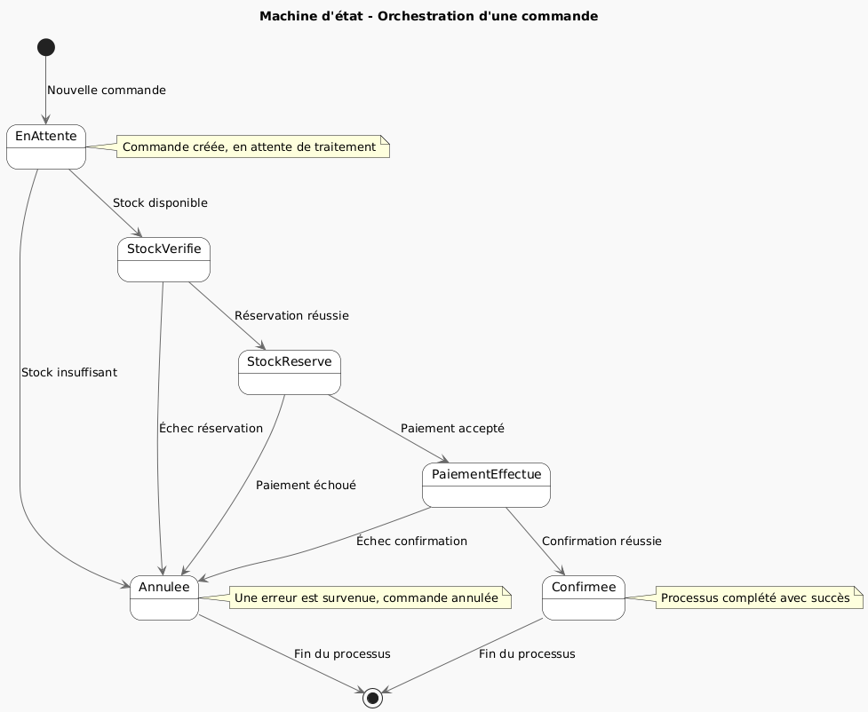

## ADR

### ADR 1

### Titre

Choix de Axios comme librairie de requêtes HTTP synchrone

### Status

Accepté

### Contexte

Afin d’implémenter la logique métier de création de commande client il est nécessaire de pouvoir communiquer entre les différentes microservices de  l’application. Il est donc nécessaire de choisir une librairie de requête HTTP adapté à notre écosystème.

### Décision

J’ai choisi d’utiliser Axios comme librairie HTTP afin d’effectuer des appels synchrones entre les services.

### Conséquences

| **Avantages**                                                                 |
| ----------------------------------------------------------------------------- |
| Facile d’intégration                                                          |
| Intégration native des timeout                                                |
| Bien documenté, largement utilisé offrant ainsi beaucoup de support en ligne. |
| **Inconvénient**                                                              |
| Plus performant que la librairie http native de Node.js                       |
| Ajoute une dépendance additionnelle devant être maintenu                      |
| Plus lourd que certaines alternatives                                         |

### ADR 2

### Titre

Séparation des entités Order et Sale

### Status

Accepté

### Contexte

Dans le cadre de l’évolution du système actuel afin d’y implémenter une logique de ecommerce, il est indispensable de différencier les commandes passées en ligne et celles effectuer en magasin. L’héritage n’étant pas une solution étant donné que celle-ci n’est pas stable sur l’ORM présente dans le projet.

### Décision

J’ai décidé d’introduire l’entités Order dans la logique métier :

Order : Représente une commande en ligne pouvant être potentiellement en traitement ou annulable. 

Sale : Représente une vente physique soit une transaction finale, irréversible

### Conséquence

| Avantages                                                                                                 |
| --------------------------------------------------------------------------------------------------------- |
| Facilite la compréhension de la logique métier entre les flux de commerce életronique et physique.        |
| Permet d’appliquer des règles de méétier distinces pour la gestion d’un panier vs transaction en magasin. |
| En ligne, une commande peut avoir plusieurs status différent, tandis qu’une vente physique est finale.    |
| Inconvénients                                                                                             |
| Ajoute une niveau de complexité, car il faut maintenant gérer deux entités                                |

## Mécanismes de compensation

En cas d’échec lors de la création de la commande client les opérations suivantes sont effectuées :

- Libération des réservations de stock
- Changement du status de la commande à annuler.

## Capture d’écran du dashboard

### Réussi 

  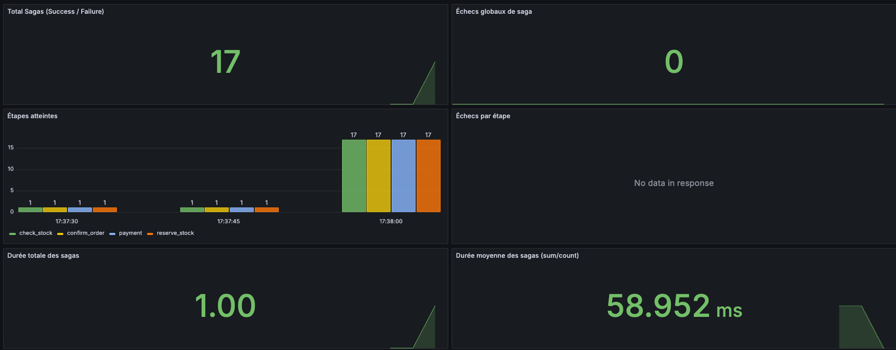

### Échec

  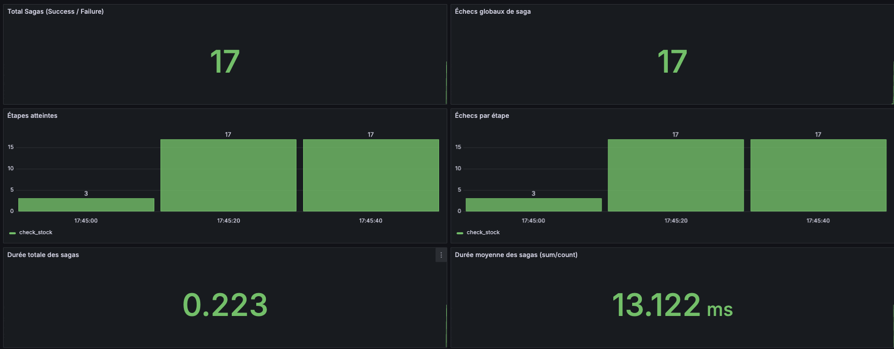

### Observabilité et comparaison

#### Documentation technique

Afin d’assurer une répartition de charge entre les deux instances du microservice cart-service, j'ai implémenté une configuration load balancing de type round-robin au niveau de l’API Gateway (NGINX).

### **Comportement configuré :**

- Deux instances du microservice **cart-service** sont déployées :
    - `cart-service`
    - `cart-service-2`
- Un upstream NGINX a été défini pour inclure ces deux instances.
- La directive `proxy_pass` du endpoint `/api/v1/cart` utilise cet upstream.
- Le mode round-robin est utilisé pour :
    - Distribuer équitablement les requêtes entrantes entre les deux instances.
    - Améliorer la scalabilité et réduire le temps de réponse lors de fortes charges.
    - Assurer une tolérance partielle aux pannes (si une instance échoue, les requêtes continuent sur l’autre).

### Test de récupération de panier par CustomerId

Un customId est choisi au hasard de 0 a 9

commande : k6 run test/microservice/cartApiTest.js

Configuration : 200 utilisateurs virtuels pendant 30 secondes

#### K6

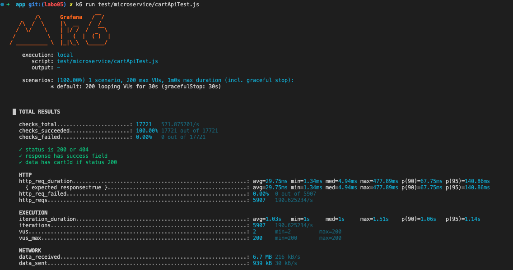

#### Grafana

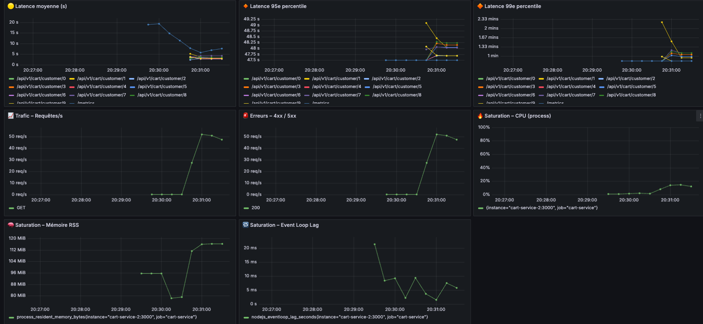

## Comparaison entre laboratoire 04 et 05

Ma comparaison de performance sera effectuer sur le test de mise à jour de produit 

Configuration : 150 utilisateurs virtuels pendant 30 secondes

commande : k6 run app/test/api/updateProductTest.js

### Laboratoire 04

#### K6

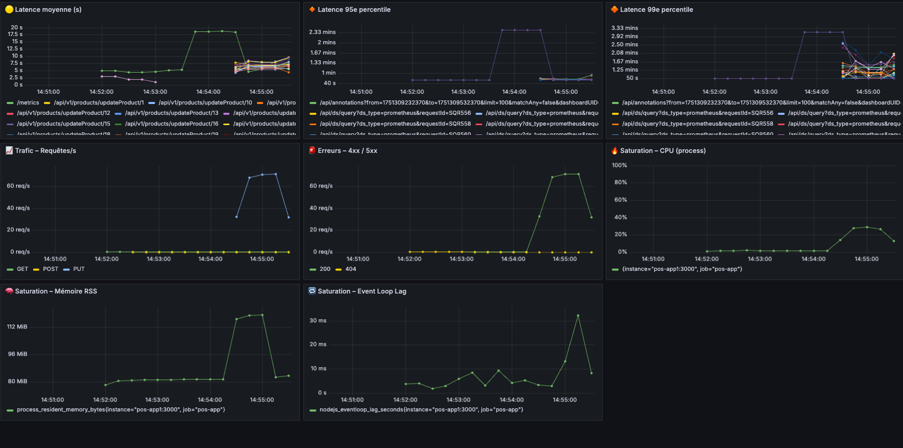

#### Grafana

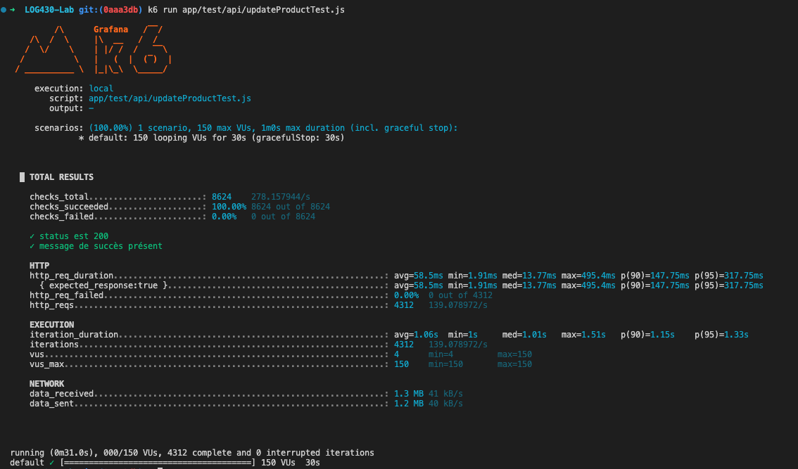

### Laboratoire 05

#### K6

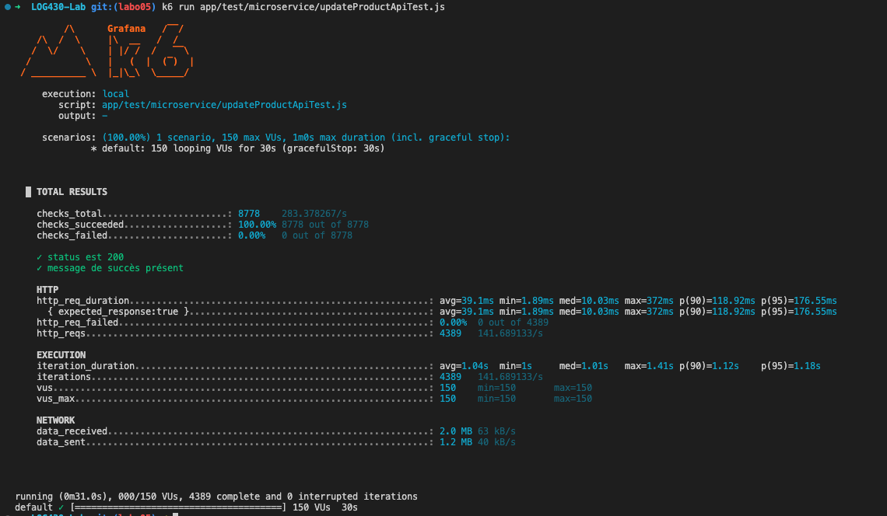

#### Grafana

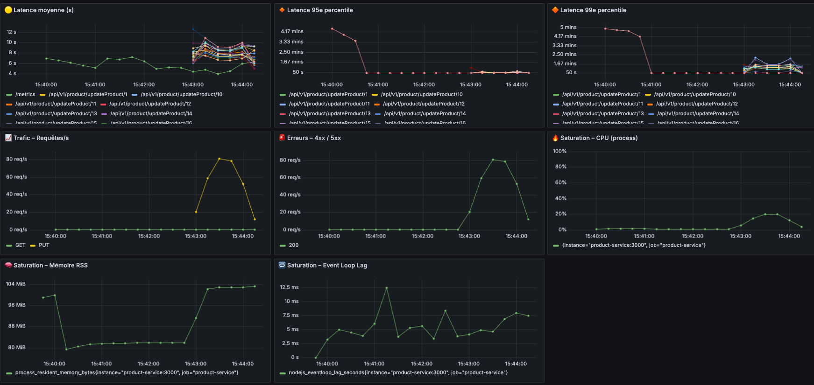

### Resultat 

| **Laboratoire 04** | Test                     | Latence moyenne (s) | Requêtes par seconde | Taux d’erreurs | Saturation CPU/mémoire |
| ------------------ | ------------------------ | ------------------- | -------------------- | -------------- | ---------------------- |
|                    | mettre à jour un produit | 11.s                | 71 req               | 0%             | 28%                    |
| **Laboratoire 05** | **Test**                 | Latence moyenne (s) | Requêtes par seconde | Taux d’erreurs | Saturation CPU/mémoire |
|                    | mettre à jour un produit | 12s                 | 81 req               | 0%             | 20%                    |

### Analyse

Latence moyenne : La latence est sensiblement la même dans les deux cas, la légère différence pour être du à l’ajout d’une couche de complexité du au routage dynamique

Requête par seconde: Le débit est supérieur via l’API Gateway, car celle-ci optimise la gestion des connexions entrantes.

Taux d’erreur: Identique dans les deux cas

Saturation CPU/mémoire : L’usage d’un APi Gateway réduit la charge direct sur l’API.

## Introduction

Dans le cadre de ce laboratoire 05, j’ai eu à faire évoluer l’architecture de mon système multi-magasin vers une architecture orienté microservices, adaptée à un contexte de commerce életronique.

## Contexte

Présentement mon système permet la gestion de plusieurs magasin et d'un entrepot sous la supervision d'une maison mère. Il est possible d'accéder au informations suivantes :

- Génération d'un rapport des ventes
- Consulter les stock d'un magasin spécifique
- Visualiser les performances des magasins
- Mettre à jour les informations d'un produit.

Toutes ces actions sont accessible au travers d'une API documenter par Swagger via http://localhost:3000/api-docs (sur la branche labo04).

## Requis

Le client souhaite désormais que système passe vers une architecture orienté microservices en plus d'ajouter des fonctionnalités propres au commercer électronique.
---

Exigences fonctionnelles

En tant que client je souhaite pouvoir :
- Créer un compte client
- Ajouter des articles à mon panier d'achat
- Retirer des articles de mon panier d'achat
- Valider ma commande

## Objectif qualité

Qualités rechercher par le client 
1	Offrir une bonne fiabilité aux usagers du système.
2	Synchronisation fiable et cohérente des données entre les stocks et les produit présenter dans la magasin électronique.
3 Offrir une bonne performance grâce à un traitement rapide des requêtes.
  
| Objectif de qualité | Description                                                                                      |
| ------------------- | ------------------------------------------------------------------------------------------------ |
| **Fiabilité**       | Je veux que mon application soit fiable et résiliente en cas de panne ou gros volume de requête. |
| **Performant**      | Je veux que mon système traite les requêtes des usagers dans un délai raisonnable.               |
| **Intégrité**       | Je veux m’assurer que les données soient cohérentes et restent fidèles aux opérations réelles.   |


## Stakeholder

| **Rôle**                                                  | **Attente**                                                                                                                                                                                                                                                                                                                                                                             |
| --------------------------------------------------------- | --------------------------------------------------------------------------------------------------------------------------------------------------------------------------------------------------------------------------------------------------------------------------------------------------------------------------------------------------------------------------------------- |
| **Acquisiteur (personne optant pour l’usage du système)** | - Déploiement simple <br> - Facile à configurer et à maintenir <br> - Système stable, fiable et sécurisé <br> - Coût faible <br> - Respect des exigences internes et légales                                                                                                                                                                                                            |
| **Évaluateur**                                            | - Système conforme aux normes <br> - Intégrité des données <br> - Traçabilité des actions sur les documents                                                                                                                                                                                                                                                                             |
| **Communicateur**                                         | - Documentation accessible <br> - Cas d’utilisation simple                                                                                                                                                                                                                                                                                                                              |
| **Développeur**                                           | - Code clair et bien documenté <br> - Facile de contribuer au répertoire                                                                                                                                                                                                                                                                                                                |
| **Mainteneur**                                            | - Intégration fluide des contributions <br> - Architecture favorisant la maintenance et l’évolutivité                                                                                                                                                                                                                                                                                   |
| **Fournisseur**                                           | - Stabilité du système <br> - Compatibilité avec les versions déployées                                                                                                                                                                                                                                                                                                                 |
| **Support technique**                                     | - Utilisation intuitive <br> - Message d’erreur empêchant les mauvaises manipulations                                                                                                                                                                                                                                                                                                   |
| **Administrateur système**                                | - Déploiement automatique <br> - Observabilité <br> - Haut taux de disponibilité                                                                                                                                                                                                                                                                                                        |
| **Administrateur**                                        | - Gestion des usagers                                                                                                                                                                                                                                                                                                                                                                   |
| **Testeur**                                               | - Documentation des cas d’usage <br> - Fonctionnalités testables et stables <br> - Contrôle qualité sur les versions finales                                                                                                                                                                                                                                                            |
| **Usager**                                                | - Facilité de prise en main <br> - Accès rapide aux documents <br> - Pouvoir signer ou faire signer un document par un tiers facilement <br> - Persistance des données                                                                                                                                                                                                                  |
| **Client**                                                | - Utilisation intuitive de l’application <br> - Facile d’accès (sans avoir à créer un compte) <br> - Un minimum d’assistance lors de l’utilisation <br> - Je veux pouvoir : <br> &nbsp;&nbsp;- Créer un compte client <br> &nbsp;&nbsp;- Ajouter des articles à mon panier d'achat <br> &nbsp;&nbsp;- Retirer des articles de mon panier d'achat <br> &nbsp;&nbsp;- Valider ma commande |


## Contraintes architecturales

Contraintes
L’architurecture de l’application doit être hébergé en utilisant la VM fournise.
L’architurecture de l’application doit être dockeriser
L'application doit être séparé en 3-4 services en se basant sur le système actuel
L'application doit également avoir au moins 3 API lié à la gestion du commerce électronique
Chaque service doit être déployé indépendamment dans son propre conteneur et avoir sa propre instance de persistance

## Contexte technique

Le système doit être orienté vers une architecture orienté microservice.


## Stratégie de solution

| **Problème identifié**                  | **Défauts**                                                                                                                                                                                                         | **Solutions proposée**                                                        |
| --------------------------------------- | ------------------------------------------------------------------------------------------------------------------------------------------------------------------------------------------------------------------- | ----------------------------------------------------------------------------- |
| Architecture serveur / client à 3 tiers | Risques de goulot d’étranglement sur le serveur si la charge est élevée<br>Grosse dépendance vers la base de données pouvant devenir un goulot d’étranglement.<br>Si un tier tombe tout le système tombe également. | Migration vers une architecture orientée microservice                         |
| Vue logique                             | Obsolète face aux nouveaux requis                                                                                                                                                                                   | Mise à jour de la vue logique pour représenter la nouvelle logique d’affaires |


## Vue logique


À noter que je n'ai pas fait d'héritage pour les entités Store et Warehouse étant donné que l'ORM que j'utilise présentement, Sequelize, ne le supporte pas pour le moment.

De même pour OrderLine et SaleLine

## Vue implémentation


## Vue déploiement


## Vue cas d'utilisation


## Vue processus

### Vue Processus ajout d'un Item au Panier

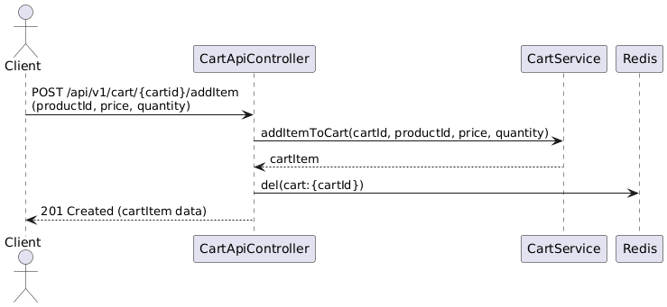

### Vue Processus retirer un Item du Panier

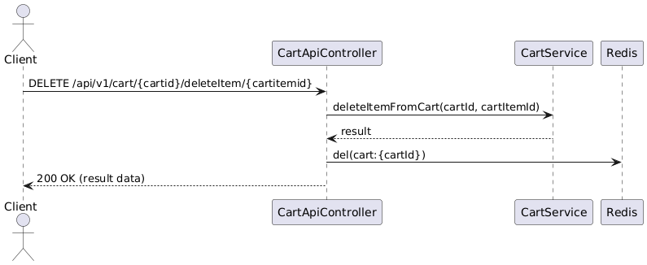

### Vue Processus ajout d'un Panier à un Client

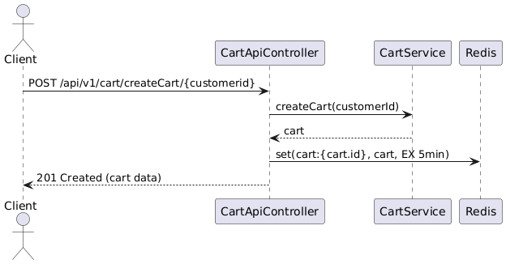

### Vue Processus ajout d'un Client

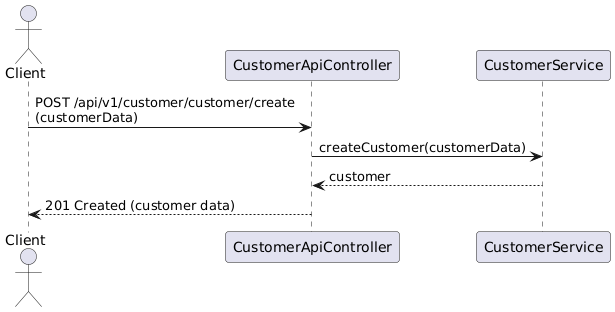

### Vue Processus ajout d'un Replenishment

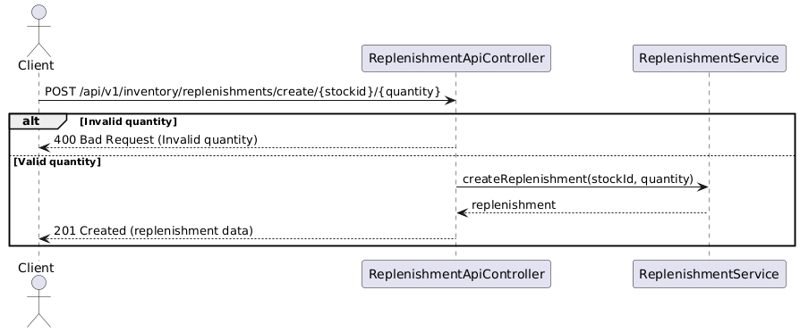

### Vue Processus créer une Commande

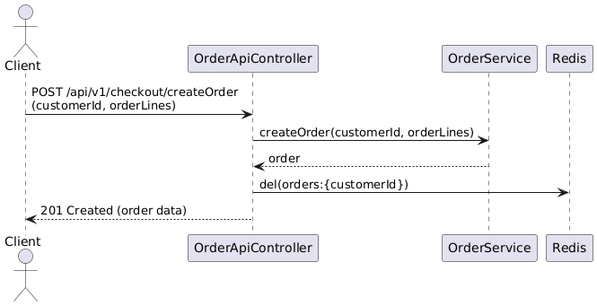

### Vue Processus mettre à jour un Produit

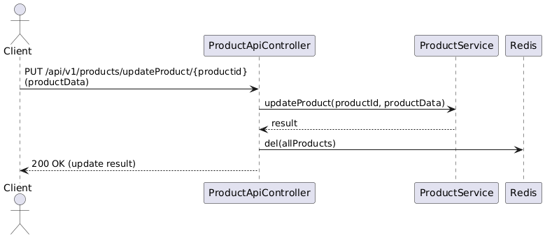

### Vue Processus récuperer Panier par ClientId

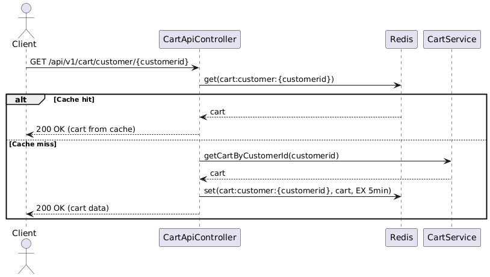

### Vue Processus récuperer Client par ClientId

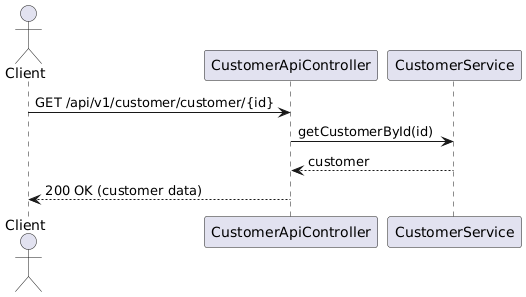

### Vue Processus récuperer Commandes par ClientId

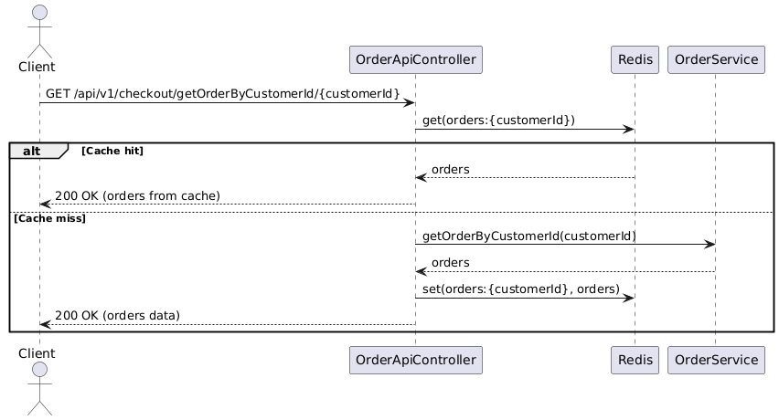

### Choix technologiques

### 1. **Node.js**

- **Justification** : Plateforme légère et rapide
- **Simplicité** : Écosystème riche en modules npm
- **Portabilité** : Fonctionne sur tous les système d’exploitation
- **Coût** : Gratuit et open source
- **Fiabilité** : Très populaire dans l’industrie avec une communauté active.

### 2. **PostgreSQL**

- **Justification** : Système de gestion de base de données relationnelle robuste et fiable
- **Simplicité** : Offre une documentation complète
- **Portabilité** : Fonctionne sur tous les système d’exploitation et facile à containeriser via Docker.
- **Coût** : Gratuit et open source
- **Fiabilité** : Conforme au propriété ACID (Atomicity, Consistency, Isolation, Durability)

### 3. **Sequelize (ORM)**

- **Justification** : Permet d’abstraire les opérations SQL via un modèle orienté objet
- **Simplicité** : Permet la manipulation des données sans écrire de requêtes SQL
- **Portabilité** : Facile à implémenter dans n’importe quel projet
- **Coût** : Gratuit et open source
- **Fiabilité** : Fiable pour les petits projets tel que POS

### 4. **Jest**

- **Justification** : Framework de test pour Node.js
- **Simplicité** : Intégration facile, compatible avec la majorité des bibliothèques JS
- **Portabilité** : Fonctionne sur toutes plateforme Node.js
- **Coût** : Gratuit
- **Fiabilité** : Permet d’assurer la qualité du code via des tests automatisés.

### 5. EJS

- **Justification** : Moteur de template qui permet de générer des pages HTML dynamiques à partir de données serveur
- **Simplicité** : Syntaxe proche de HTML avec intégration facile de logique JS
- **Portabilité** : Compatible avec Express
- **Coût** : Gratuit et open source
- **Fiabilité** : Suffisant pour des vues dynamiques simples

### 6. Express

- **Justification** : Framework permettant de créer des serveurs web en Node.js
- **Simplicité** : Syntaxe simple, facilite la gestion des routes, middlewares et requêtes HTTP
- **Portabilité**  : Fonctionne avec tout projet Node.js, s’intègre facilement à d’autres bibliothèques comme Sequelize ou EJS
- **Coût**  : Gratuit et open source
- **Fiabilité**  : Maintenu activement par la communauté et utilisé dans des milliers de projets professionnels

### 7. **NGINX**

- **Justification** : Serveur web performant, également utilisé comme reverse proxy et load balancer
- **Simplicité** : Configuration simple permet de servir comme proxy des requêtes ou faire du load balancing
- **Portabilité** : facile à déployer via Docker
- **Coût** : Gratuit et open source
- **Fiabilité** : Très utilisé en production, performant et stable même sous forte charge

### 8. **Prometheus**

- **Justification** : Système de monitoring et de collecte de métriques efficace
- **Simplicité** : Facile à configurerm permet de collecter et stocker des métriques via HTTP endpoints
- **Portabilité** : S’intègre bien avec des containers Docker ou Kubernetes
- **Coût** : Gratuit et open source
- **Fiabilité** : Permet d'obtenir des données crutiales sur le fonctionnement du système

### 9. **Grafana**

- **Justification** : Outil de visualisation de données et métriques sous forme de dashboards interactifs
- **Simplicité** : Interface web intuitive permettant de créer rapidement des graphiques et alertes
- **Portabilité** : Compatible avec Prometheus
- **Coût** : Gratuit en version open source
- **Fiabilité** : Utilisé mondialement pour ses capacités de visualisation robustes et sa large communauté de plugins

### 10. **Swagger (OpenAPI)**

- **Justification** : Permet de documenter, visualiser et tester des API REST de manière standardisée
- **Simplicité** : Génération automatique de la documentation à partir de l’API ou écriture manuelle en YAML/JSON
- **Portabilité** : Compatible avec Swagger-UI Express
- **Coût** : Gratuit et open source
- **Fiabilité** : Améliore la compréhension et la consommation des APIs, très utilisé dans l’industrie pour la collaboration entre équipes


### Domain-Driven Design 

| Domaine              | Type de domaine    | Responsabilités principales                                                                                                                   |
| -------------------- | ------------------ | --------------------------------------------------------------------------------------------------------------------------------------------- |
| Gestion de panier    | Domaine de support | Gérer la création, la modification et la suppression des paniers d’achat; ajouter ou retirer des articles; calculer le total du panier.       |
| Gestion de commande  | Domaine principal  | Gérer la création, la validation, le suivi et l’historique des commandes clients; maintenir le statut des commandes.                          |
| Gestion de client    | Domaine principal  | Gérer les informations des clients (création de compte, authentification, profil); assurer la relation client.                                |
| Gestion d’inventaire | Domaine principal  | Suivre les quantités de produits en stock dans les entrepôts et magasins; gérer les mouvements d’inventaire et le réapprovisionnement.        |
| Gestion de magasin   | Domaine principal  | Gérer les informations des magasins physiques (nom, adresse, horaires); lier les magasins aux inventaires et aux ventes effectuées sur place. |
| Gestion de produit   | Domaine principal  | Gérer le catalogue de produits incluant les informations, prix et disponibilité; maintenir l’intégrité des données produits.                  |
| Gestion de vente     | Domaine principal  | Gérer le processus de vente incluant le paiement, la génération de facture et l’enregistrement des transactions.                              |

## Structure

```

.
├── app
│   ├── docker-compose.yml
│   ├── Dockerfile
│   ├── eslint.config.js
│   ├── jest.config.js
│   ├── logs
│   │   └── nginx
│   │       ├── access.log
│   │       └── error.log
│   ├── microservices
│   │   ├── cart-service
│   │   │   ├── app.js
│   │   │   ├── controllers
│   │   │   │   └── CartApiController.js
│   │   │   ├── database.js
│   │   │   ├── Dockerfile
│   │   │   ├── generate-doc.js
│   │   │   ├── models
│   │   │   │   ├── Cart.js
│   │   │   │   └── CartItem.js
│   │   │   ├── package-lock.json
│   │   │   ├── package.json
│   │   │   ├── routes
│   │   │   │   ├── ApiRoutes.js
│   │   │   │   └── CartApiRoutes.js
│   │   │   ├── server.js
│   │   │   ├── services
│   │   │   │   └── CartService.js
│   │   │   ├── swagger.json
│   │   │   └── utils
│   │   │       ├── logger.js
│   │   │       ├── metrics.js
│   │   │       └── redisClient.js
│   │   ├── checkout-service
│   │   │   ├── app.js
│   │   │   ├── controllers
│   │   │   │   └── OrderApiController.js
│   │   │   ├── database.js
│   │   │   ├── Dockerfile
│   │   │   ├── generate-doc.js
│   │   │   ├── generateFakeData.js
│   │   │   ├── models
│   │   │   │   ├── Order.js
│   │   │   │   └── OrderLine.js
│   │   │   ├── package-lock.json
│   │   │   ├── package.json
│   │   │   ├── routes
│   │   │   │   ├── ApiRoutes.js
│   │   │   │   └── OrderApiRoutes.js
│   │   │   ├── server.js
│   │   │   ├── services
│   │   │   │   └── OrderService.js
│   │   │   ├── swagger.json
│   │   │   └── utils
│   │   │       ├── logger.js
│   │   │       └── redisClient.js
│   │   ├── customer-service
│   │   │   ├── app.js
│   │   │   ├── controllers
│   │   │   │   └── CustomerApiController.js
│   │   │   ├── database.js
│   │   │   ├── Dockerfile
│   │   │   ├── generate-doc.js
│   │   │   ├── generateFakeData.js
│   │   │   ├── models
│   │   │   │   └── Customer.js
│   │   │   ├── package-lock.json
│   │   │   ├── package.json
│   │   │   ├── routes
│   │   │   │   ├── ApiRoutes.js
│   │   │   │   └── CustomerApiRoutes.js
│   │   │   ├── server.js
│   │   │   ├── services
│   │   │   │   └── CustomerService.js
│   │   │   ├── swagger.json
│   │   │   └── utils
│   │   │       └── logger.js
│   │   ├── inventory-service
│   │   │   ├── app.js
│   │   │   ├── controllers
│   │   │   │   └── ReplenishmentApiController.js
│   │   │   ├── database.js
│   │   │   ├── Dockerfile
│   │   │   ├── generate-doc.js
│   │   │   ├── generateFakeData.js
│   │   │   ├── models
│   │   │   │   ├── Replenishment.js
│   │   │   │   ├── Stock.js
│   │   │   │   └── Warehouse.js
│   │   │   ├── package-lock.json
│   │   │   ├── package.json
│   │   │   ├── routes
│   │   │   │   ├── ApiRoutes.js
│   │   │   │   └── ReplenishmentApiRoutes.js
│   │   │   ├── server.js
│   │   │   ├── services
│   │   │   │   └── ReplenishmentService.js
│   │   │   ├── swagger.json
│   │   │   └── utils
│   │   │       └── logger.js
│   │   ├── product-service
│   │   │   ├── app.js
│   │   │   ├── controllers
│   │   │   │   └── ProductApiController.js
│   │   │   ├── database.js
│   │   │   ├── Dockerfile
│   │   │   ├── generate-doc.js
│   │   │   ├── generateFakeData.js
│   │   │   ├── models
│   │   │   │   ├── Category.js
│   │   │   │   └── Product.js
│   │   │   ├── package-lock.json
│   │   │   ├── package.json
│   │   │   ├── routes
│   │   │   │   ├── ApiRoutes.js
│   │   │   │   └── ProductApiRoutes.js
│   │   │   ├── server.js
│   │   │   ├── services
│   │   │   │   └── ProductService.js
│   │   │   ├── swagger.json
│   │   │   └── utils
│   │   │       ├── logger.js
│   │   │       ├── metrics.js
│   │   │       └── redisClient.js
│   │   ├── sale-service
│   │   │   ├── app.js
│   │   │   ├── controllers
│   │   │   ├── database.js
│   │   │   ├── Dockerfile
│   │   │   ├── models
│   │   │   │   ├── Sale.js
│   │   │   │   └── SaleLine.js
│   │   │   ├── package-lock.json
│   │   │   ├── package.json
│   │   │   ├── routes
│   │   │   │   └── ApiRoutes.js
│   │   │   ├── server.js
│   │   │   ├── services
│   │   │   └── utils
│   │   │       └── logger.js
│   │   └── store-service
│   │       ├── app.js
│   │       ├── controllers
│   │       ├── database.js
│   │       ├── Dockerfile
│   │       ├── models
│   │       │   ├── ParentStore.js
│   │       │   └── Store.js
│   │       ├── package-lock.json
│   │       ├── package.json
│   │       ├── routes
│   │       │   └── ApiRoutes.js
│   │       ├── server.js
│   │       └── utils
│   │           └── logger.js
│   ├── nginx
│   │   └── nginx.conf
│   ├── output
│   ├── package-lock.json
│   ├── package.json
│   ├── prometheus.yml
│   ├── src
│   │   ├── api
│   │   │   ├── controllers
│   │   │   │   ├── ParentStoreApiController.js
│   │   │   │   ├── ProductApiController.js
│   │   │   │   ├── ReplenishmentApiController.js
│   │   │   │   └── StoreApiController.js
│   │   │   └── routes
│   │   │       ├── ApiRoutes.js
│   │   │       ├── ParentStoreApiRoutes.js
│   │   │       ├── ProductApiRoutes.js
│   │   │       ├── ReplenishmentApiRoutes.js
│   │   │       └── StoreApiRoutes.js
│   │   ├── app.js
│   │   ├── controllers
│   │   │   ├── ParentStoreController.js
│   │   │   ├── ReplenishmentController.js
│   │   │   ├── StoreController.js
│   │   │   └── WarehouseController.js
│   │   ├── CreateFakeData.js
│   │   ├── database.js
│   │   ├── migrate.js
│   │   ├── models
│   │   │   ├── Category.js
│   │   │   ├── index.js
│   │   │   ├── ParentStore.js
│   │   │   ├── Product.js
│   │   │   ├── Replenishment.js
│   │   │   ├── Sale.js
│   │   │   ├── SaleLine.js
│   │   │   ├── Stock.js
│   │   │   ├── Store.js
│   │   │   └── Warehouse.js
│   │   ├── routes
│   │   │   ├── ParentStoreRoutes.js
│   │   │   ├── ReplenishmentRoutes.js
│   │   │   ├── StoreRoutes.js
│   │   │   └── WarehouseRoutes.js
│   │   ├── server.js
│   │   ├── services
│   │   │   ├── ParentStoreService.js
│   │   │   ├── ProductService.js
│   │   │   ├── ReplenishmentService.js
│   │   │   ├── StockService.js
│   │   │   ├── StoreService.js
│   │   │   └── WarehouseService.js
│   │   ├── tokenAuth.js
│   │   ├── utils
│   │   │   ├── logger.js
│   │   │   ├── metrics.js
│   │   │   └── redisClient.js
│   │   └── views
│   │       ├── allStores.ejs
│   │       ├── index.ejs
│   │       ├── parentStoreDashboard.ejs
│   │       ├── replenishmentConfirmation.ejs
│   │       ├── replenishmentForm.ejs
│   │       ├── storeDetails.ejs
│   │       └── warehouseStocks.ejs
│   ├── test
│   │   ├── api
│   │   │   ├── salesStatsTest.js
│   │   │   ├── storeDetailsTest.js
│   │   │   └── updateProductTest.js
│   │   ├── microservice
│   │   │   ├── cartApiTest.js
│   │   │   └── updateProductApiTest.js
│   │   ├── ParentStoreApiRoutes.test.js
│   │   ├── ParentStoreService.test.js
│   │   ├── ProductApiRoutes.test.js
│   │   ├── ReplenishmentApiRoutes.test.js
│   │   ├── ReplenishmentService.test.js
│   │   ├── StockService.test.js
│   │   ├── StoreApiRoutes.test.js
│   │   ├── StoreService.test.js
│   │   └── WarehouseService.test.js
│   └── tools
│       └── generatedata
│           ├── createFakeData.js
│           ├── database.js
│           ├── Dockerfile
│           ├── migrate.js
│           ├── models
│           │   ├── Cart.js
│           │   └── CartItem.js
│           ├── package.json
│           └── utils
│               └── logger.js
├── docs
│   ├── ADR
│   │   ├── ADR1.md
│   │   ├── ADR2.md
│   │   ├── ADR3.md
│   │   ├── ADR4.md
│   │   ├── ADR5.md
│   │   └── ADR6.md
│   ├── images
│   │   ├── Labo03-Instructions
│   │   │   ├── Etape1.png
│   │   │   ├── Etape2.png
│   │   │   └── Etape3.png
│   │   ├── Labo05
│   │   │   ├── grafanaLabo04UpdateProduct.png
│   │   │   ├── GrafanaTestRecupererPanierParCustomerId.png
│   │   │   ├── k6labo04UpdateProduct.png
│   │   │   ├── k6TestRecupererPanierParCustomerId.png
│   │   │   ├── labo05grafanaUpdateProduct.png
│   │   │   └── labo05k6UpdateProduct.png
│   │   ├── ParentStore
│   │   │   ├── ParentStoreEtape1.png
│   │   │   └── ParentStoreEtape2.png
│   │   ├── Product
│   │   │   ├── ProductEtape1.png
│   │   │   └── ProductEtape2.png
│   │   ├── Replenishment
│   │   │   ├── ReplenishmentEtape1.png
│   │   │   └── ReplenishmentEtape2.png
│   │   └── Store
│   │       ├── StoreEtape1.png
│   │       └── StoreEtape2.png
│   └── UML
│       ├── microservices
│       │   ├── VueProcessusAjoutItem.puml
│       │   ├── VueProcessusCreateClient.puml
│       │   ├── VueProcessusCreateReplenishment.puml
│       │   ├── VueProcessusCreationCart.puml
│       │   ├── VueProcessusCreerCommande.puml
│       │   ├── VueProcessusMettreAJourProduit.puml
│       │   ├── VueProcessusRecupererCart.puml
│       │   ├── VueProcessusRecupererClientParId.puml
│       │   ├── VueProcessusRecupererCommandeParClient.puml
│       │   └── VueProcessusSupprimerItem.puml
│       ├── VueCasUtilisation.puml
│       ├── VueDeploiement.puml
│       ├── VueImplementation.puml
│       ├── VueLogique.puml
│       ├── VueProcessusAfficherConfirmationReplenishment.puml
│       ├── VueProcessusAfficherDashboardParentStore.puml
│       ├── VueProcessusAfficherFormulaireReplenishment.puml
│       ├── VueProcessusAfficherLesDetailsDuMagasin.puml
│       ├── VueProcessusAfficherStocksEntrepot.puml
│       └── VueProcessusAfficherTousLesMagasins.puml
├── out
│   └── docs
│       └── UML
│           ├── microservices
│           │   ├── VueProcessusAjoutItem
│           │   │   └── SequenceAddItemToCart.png
│           │   ├── VueProcessusCreateClient
│           │   │   └── SequenceCreateCustomer.png
│           │   ├── VueProcessusCreateReplenishment
│           │   │   └── SequenceCreateReplenishment.png
│           │   ├── VueProcessusCreationCart
│           │   │   └── SequenceCreateCart.png
│           │   ├── VueProcessusCreerCommande
│           │   │   └── SequenceCreateOrder.png
│           │   ├── VueProcessusMettreAJourProduit
│           │   │   └── SequenceUpdateProduct.png
│           │   ├── VueProcessusRecupererCart
│           │   │   └── SequenceGetCartByCustomer.png
│           │   ├── VueProcessusRecupererClientParId
│           │   │   └── SequenceGetCustomerById.png
│           │   ├── VueProcessusRecupererCommandeParClient
│           │   │   └── SequenceGetOrdersByCustomer.png
│           │   └── VueProcessusSupprimerItem
│           │       └── SequenceDeleteItemFromCart.png
│           ├── VueCasUtilisation
│           │   ├── VueCasUtilisation.png
│           │   └── VueCasUtilisationClient.png
│           ├── VueDeploiement
│           │   └── VueDeploiement.png
│           ├── VueImplementation
│           │   └── VuePackagePOS.png
│           ├── VueLogique
│           │   └── VueLogique.png
│           ├── VueProcessusAfficherConfirmationReplenishment
│           │   └── VueProcessusAfficherConfirmationReplenishment.png
│           ├── VueProcessusAfficherFormulaireReplenishment
│           │   └── VueProcessusAfficherFormulaireReplenishment.png
│           ├── VueProcessusAfficherLesDetailsDuMagasin
│           │   └── VueProcessusAfficherLesDetailsDuMagasin.png
│           ├── VueProcessusAfficherStocksEntrepot
│           │   └── VueProcessusAfficherStocksEntrepot.png
│           └── VueProcessusAfficherTousLesMagasins
│               └── VueProcessusAfficherTousLesMagasins.png
└── README.md

```
